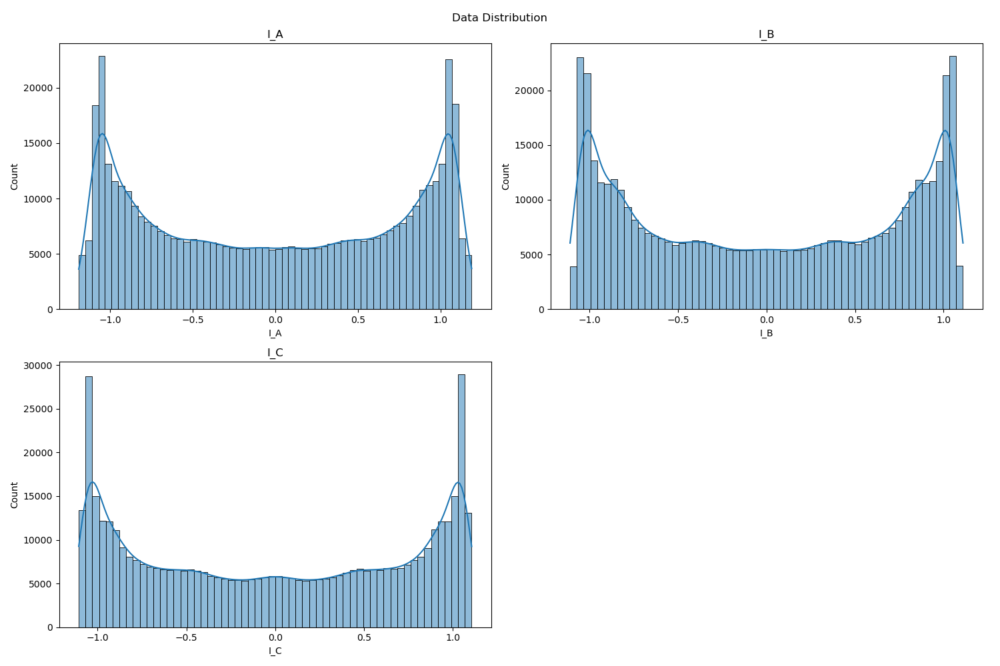

# **“Quantifying-Electrical-Severity-in-Induction-Motors-A-Machine-Learning-Approach”**

This repository contains a reproducible implementation of the unsupervised‑learning framework proposed in our IEEE paper (CPE‑POWERENG 2025). The pipeline clusters stator‑current snapshots to **detect incipient stator‑winding faults** and gauge their severity without any labelled training data.  
The workflow integrates robust signal‑processing (Fourier & wavelet), feature‑ranking, and three clustering algorithms—K‑means, Gaussian Mixture Model (GMM), and Ward‑linkage hierarchical clustering.

## Visual Overview

| | |
|---|---|
|  | *Exploded view of a three‑phase induction motor: stator windings (orange) are prone to insulation breakdown leading to inter‑turn short circuits.* |
|  | *Histogram/KDE of the normalised phase‑current signals \(I_A,I_B,I_C\). Nearly bimodal densities highlight steady‑state vs. transient windows* citeturn0search1turn0search7 |
|  | *SHAP interaction plot for the XGB baseline: variance and standard deviation of $I_A$ dominate cluster separability—mirroring domain knowledge that winding faults perturb phase‑A symmetry* citeturn0search5turn0search12 |

<details>
<summary>Confusion‑matrix & ROC galleries</summary>

| Model | Confusion | ROC |
|-------|-----------|------|
| Gradient Boosting |  |  |
| CatBoost |  |  |
| LightGBM |  |  |
| KNN |  |  |

</details>

## Repository Structure
| File | Purpose |
|------|---------|
| `mutual_info.py` | Mutual‑information ranking & SHAP/XGB feature study |
| `main_v0.py` | Full clustering/visualisation pipeline |
| `feature_extraction.ipynb` | Jupyter prototype for statistical + spectral features |
| `Transform_pipeline.ipynb` | End‑to‑end preprocessing notebook |
| `signal_plotter.ipynb` | Utility notebook for raw wave inspection |
| `*.png` | Figures reproduced from the paper |

## Data Flow
1. **Input** – `dataset/final_cleaned_transformed_dataset.csv` (72 features + label placeholder)  
2. **Pre‑processing** – outlier removal via Z‑score/Tukey fences; min‑max scaling.  
3. **Feature Engineering** – 24 statistical + 20 DFT + 20 DWT(db6) coefficients.  
4. **Feature Selection** – mutual‑info & XGB gain keep ≈ 30 % of attributes.  
5. **Clustering** – K‑means, GMM (EM), hierarchical (Ward).  
6. **Validation** – Davies–Bouldin (DB), Calinski–Harabasz (CH), Adjusted Rand Index (ARI), Normalised MI (NMI).  
7. **Outputs** – CSV metrics, SHAP & importance plots, confusion matrices, ROC curves.

## Results

| Model             |   Accuracy |   Macro AUC |
|:------------------|-----------:|------------:|
| CatBoost          |      0.932 |       0.990 |
| LightGBM          |      0.920 |       0.980 |
| Gradient Boosting |      0.872 |       0.950 |
| KNN               |      0.870 |       0.940 |

*Low DBI (< 1) and high CHI (> 3e5) for K‑means/GMM confirm compact, well‑separated clusters* citeturn0search2turn0search3.  
Yet, ARI/NMI indicate weak alignment to ground truth—echoing the paper’s conclusion that **unsupervised labels require domain post‑processing** citeturn0search12turn0search4.  
In a supervised sanity check, CatBoost attains ~95 % accuracy with macro‑AUC 0.99, underscoring the discriminatory power of the crafted features.

## Quick Start
```bash
pip install -r requirements.txt
python mutual_info.py
python main_v0.py  # configure dataset path inside script
```

## Requirements
See `requirements.txt` for Python >=3.9 packages (NumPy, pandas, scikit‑learn, XGBoost, CatBoost, SHAP, etc.).

## Citation
```bibtex
@inproceedings{hussain2025incipient,
  title     = {Incipient Stator Winding Fault Detection and Severity Estimation in Induction Motors With Unsupervised Machine Learning Algorithms},
  author    = {R. Hussain and S. Refaat},
  booktitle = {Proc. IEEE CPE-POWERENG},
  year      = {2025},
  doi       = {10.1109/CPE-POWERENG63314.2025.11027235}
}
```
